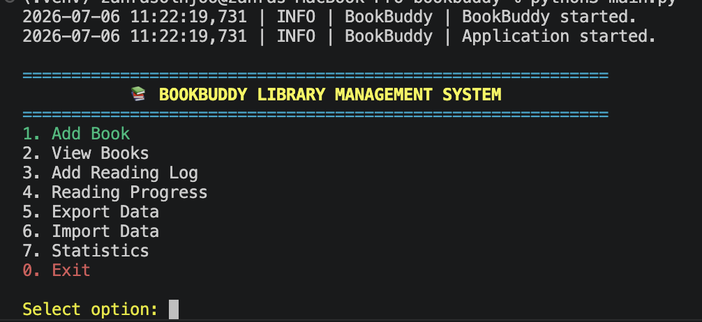
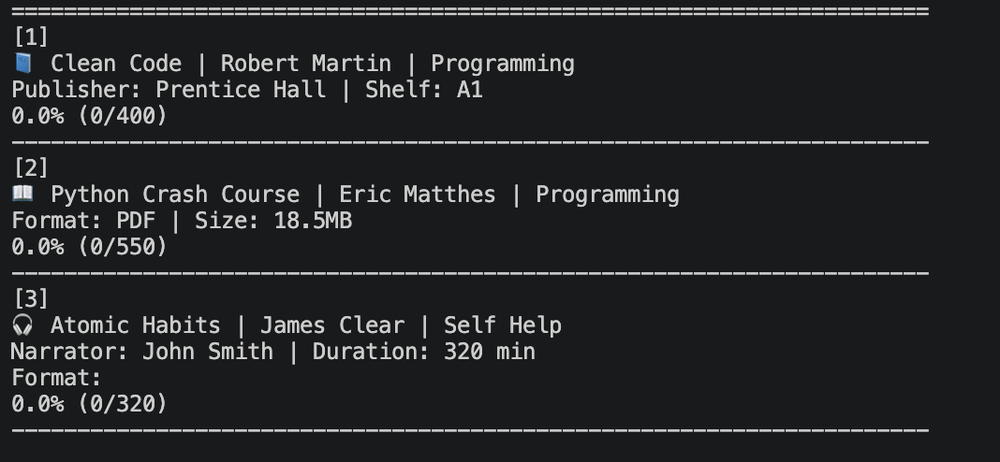
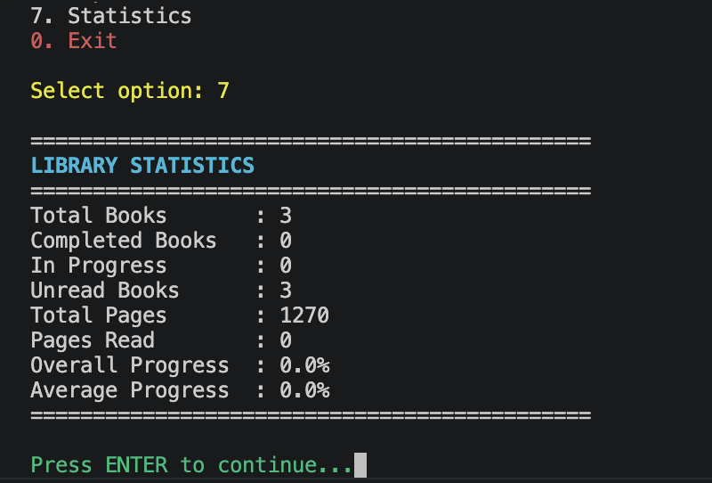

<div align="center">

# 📚 BookBuddy

### A Python OOP Library Management System


A command-line application for managing books, tracking reading progress,
and exporting/importing data using clean Object-Oriented Programming principles.

</div>

---

# ✨ Features

- 📚 Add Physical Books
- 💻 Add EBooks
- 🎧 Add AudioBooks
- 📖 Track Reading Progress
- 📝 Reading Log Management
- 📊 Reading Statistics
- 💾 Export & Import (JSON / Pickle)
- 🏭 Factory Pattern
- 📦 Service Layer Architecture
- 🪵 Logging System
- 🔁 Retry Decorator
- 📂 Context Manager
- 🧪 Unit Testing with pytest

---

# 🏗 Project Structure

```text
bookbuddy/
│
├── config/
├── exceptions/
├── models/
├── services/
├── storage/
├── utils/
│
├── main.py
├── README.md
└──requirements.txt
```

---

# 🧠 OOP Concepts Used

- Encapsulation
- Inheritance
- Polymorphism
- Abstract Base Classes (ABC)
- Factory Pattern
- Service Layer
- Custom Exceptions
- Decorators
- Context Managers
- Logging
- Type Hinting

---

# 🚀 Installation

```bash
git clone https://github.com/zahra-solhjoo/bookbuddy.git

cd bookbuddy

python -m venv .venv

source .venv/bin/activate      # macOS/Linux

pip install -r requirements.txt
```

---

# ▶️ Run

```bash
python main.py
```

---

# 📋 Main Menu

```text
============================================================
📚 BOOKBUDDY LIBRARY MANAGEMENT SYSTEM
============================================================

1. Add Book
2. View Books
3. Add Reading Log
4. Reading Progress
5. Export Data
6. Import Data
7. Statistics
0. Exit
```

---

# 📸 Screenshots

## Main Menu




---

## Books




---

## Statistics





---

# 📦 Requirements

- Python 3.10+
- colorama
- pytest

---

# 👨‍💻 Author

**Zahra Solhjoo**

GitHub:
https://github.com/zahra-solhjoo

---

⭐ If you like this project, give it a star.
